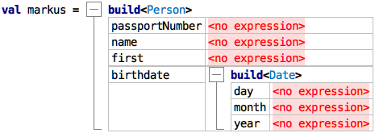
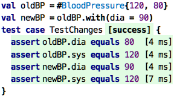

Go back to [Types](../chapter04_functions/index.md)

# Chapter 05: Structured Values

### Motivation

Remember the introductory example in the [previous chapter](../chapter04_functions/index.md)?

&nbsp;&nbsp;[src](http://127.0.0.1:63320/node?ref=r%3Ae00f4849-fe23-45e3-8ca0-de542fab6857%28chapter05_structured%29%2F6455317040172064278)

I am sure you have since forgotten what the first four columns stood
for. Let me remind you:  the `E` column calculates a (hypothetical) risk
factor based on a person's age (`A`), their weight (`B`) and their
diastolic (`C`) and systolic (`D`) blood pressures.

We identified two problems before: first, the columns don't have useful names,
so it is hard to remember -- as I demonstrated above -- what these stand for.
Second, there is the problem of the expression in column `E` that is repeated
five times. I the [previous chapter](../chapter04_functions/index.md) we solved
the latter issue through function cells and functions. In this chapter, we will
solve the first issue.

To continue the argument: if you reread the paragraph before the last one, what
is the word that is central to the story? Right, _person_. How is this 
concept represented in the spreadsheet? Or in the functions we defined in the
previous chapter? Not at all. This is the core of the problem. What we need is
a way of grouping data that belongs to, or is part of, a single entity.

### Structured Types: Records ###

Looking at the spreadsheet above, it is a classic "data table": each row represents
a record, and the columns (maybe except the last one with the function) represent fields, or _members_ of that record. So let's write this down as a first-class declaration:

&nbsp;&nbsp;[src](http://127.0.0.1:63320/node?ref=r%3Ae00f4849-fe23-45e3-8ca0-de542fab6857%28chapter05_structured%29%2F6455317040172079031)

A `record` is literally like a row in a database, the members of the record
are typed names, just like the parameters of functions. So, not much new here.

However, conceptually we have done something important: we have created our
own _abstraction_, the abstraction of a person in the context of our system.
You might say: well, it's not really a person if it doesn't have a name and
a birth date. However, what is a person in the context of a particular system,
i.e., how we abstract the real-world concept into software, is our decision.
If we are interested in age, weight, and the blood pressure, then it is 
perfectly ok to define a person to have those specific fields. Other people,
for other uses, might define a person differently. You can, of course, argue
that we should not call it a `Person`, but rather a `Patient`. Or `PatientData`.
Or `DataForRiskFactorCalculation`. All are valid. It depends on what you want
to communicate to the reader of the program (because tools of course don't 
care about names, as long as they are unique).  

### Records are Types ###

Record declarations like the one above are types, similar to `number`, `boolean`
or `string`. In contrast to those, however, they are not built into the language,
they are defined by you, the user. With the `Person` declaration above, you 
have created a type that you can use like any other type. In particular, we
can rewrite the `riskFactor` function that we have seen before:

&nbsp;&nbsp;[src](http://127.0.0.1:63320/node?ref=r%3Ae00f4849-fe23-45e3-8ca0-de542fab6857%28chapter05_structured%29%2F6455317040172094667)

The function now takes a whole `Person` as its only argument. Inside the function
we can access the members of that person `p` through the dot notation. Remember
that we had introduced it earlier as an alternative means of calling functions;
now we use it to access members. This is why the dot operation is often also called
the _member access operation_. 
 

### Creating Record Instances ###

We have said above that the spreadsheet can be seen as a kind of database where
each row is a record. With what we now know about `record`s, we have to phrase
this a little bit more carefully. The proper way of saying this is that each
row is an _instance_ of a record type, where that record type defines the fields
that all of the instances (rows) have. So the record defines the structure, the
record _instances_ defines specific rows, where each row provides a value for
each field/member of the record. So how can we create instances of user-defined
records, such as the `Person` above? Here is how:

&nbsp;&nbsp;[src](http://127.0.0.1:63320/node?ref=r%3Ae00f4849-fe23-45e3-8ca0-de542fab6857%28chapter05_structured%29%2F6455317040172188049)

So, to create an instance of a record, you use the `#` symbol, the name
of the record, and then values for the members, positionally, like in functions,
but using curly braces. Once we have values of `Person` type, we can call
the `riskFactor` function on them (and them, of course, write tests):

&nbsp;&nbsp;[src](http://127.0.0.1:63320/node?ref=r%3Ae00f4849-fe23-45e3-8ca0-de542fab6857%28chapter05_structured%29%2F6455317040172258024)

### Using the dot Notation for the Risk Factor ###

Going back to the sheet above, the `E` column contained the call to the
`riskFactor` function. In some sense, the function was _part of_ the record.
Calling a function on a person, as in `riskFactor(p1)` is kind ugly. It would
be much nicer to be able to write `p1.riskFactor()`. The reasons why this is nice are

* it is syntactically similar to accessing members, creating a more homogeneous 
  feel for the overall program,
 
* and it allows for better tool support, because, after we have typed `p1.`, the
  tool will propose to us only members and the functions.
  
To make this possible, we have to make the `riskFactor` an _extension_ function.
Extension functions are identical to regular function, except that they "extend"
a type in the sense that you can call them with the first argument before the dot:

&nbsp;&nbsp;[src](http://127.0.0.1:63320/node?ref=r%3Ae00f4849-fe23-45e3-8ca0-de542fab6857%28chapter05_structured%29%2F6455317040172302811)

### Data Modeling ###

Remember the discussion about whether `Person` is a good name for the record
we used so far in this chapter? Let's resolve this issue by modeling that 
person/patient/blood pressure example a little bit more seriously. Take a look at this:

&nbsp;&nbsp;[src](http://127.0.0.1:63320/node?ref=r%3Ae00f4849-fe23-45e3-8ca0-de542fab6857%28chapter05_structured%29%2F6455317040172321151)

On the left we see a few plain records for `Date`, the `BasicData` of a person,
and the two components of the `BloodPressure`. On the right, we see two more
records. Here there's something interesting. First the `PatientData` uses
`BloodPressure` as the type of one of its members.  It also uses the `Person`
as a type, but as a _reference_. This is an important distinction:

The regular use of a record type (in a member) represents _composition_.
This means, that the respective 'BloodPressure' instance is _owned_ by 
the referencing `PatientData` record. A particular instance can only be owned
by _one_ other instance, and if the owner is deleted, the composed/owned 
instance is deleted as well. Essentially, composition creates a tree.

The relationship between `PatientData` and `Person` is different, it is
a (non-composition) reference. Here, the target instance has stands on its
own, it is _not_ owned by the referencing instance, and the lifecycles are
not connected: if the instance of `PatientData` is deleted, the `Person`
that was referenced by that particular `PersonData` continues to exist.

Technically, the `PatientData` stores a reference to the `Person` by
storing the `Person`'s identifying member. That identifying member is 
specified in the `referenceable<...>` part of the `Person` record
declaration. Only records that have a `referenceable` clause can be 
used as a reference.

Here is an example using the records. We use the familiar `#` notation
to create instances, and we use the `.ref` operator to retrieve a reference
to a record, the `Person` in this case.

&nbsp;&nbsp;[src](http://127.0.0.1:63320/node?ref=r%3Ae00f4849-fe23-45e3-8ca0-de542fab6857%28chapter05_structured%29%2F6455317040172344290)

The `#` notation with its positional arguments can become hard to read for
bigger models. This is why, as an alternative, there is the `build` expression.
We can rewrite the code above as follows:

&nbsp;&nbsp;[src](http://127.0.0.1:63320/node?ref=r%3Ae00f4849-fe23-45e3-8ca0-de542fab6857%28chapter05_structured%29%2F6455317040172383860)

Here, the parameters are specified by name, and the representation is more
tree-like. Additionally, once you write something like `build<Person>`, the 
tool directly pre-fills the necessary fields: 

&nbsp;&nbsp;[src](http://127.0.0.1:63320/node?ref=r%3Ae00f4849-fe23-45e3-8ca0-de542fab6857%28chapter05_structured%29%2F6455317040172450038)

### Path Expressions ###

Let's say we have the `markusData` in our hands. What can we do with it? Here
are some tests that demonstrate some uses:

&nbsp;&nbsp;[src](http://127.0.0.1:63320/node?ref=r%3Ae00f4849-fe23-45e3-8ca0-de542fab6857%28chapter05_structured%29%2F6455317040172457144)

You can join multiple dot expressions together into what is then called 
a _path_ expression. If you come across a reference (as in `PatientData.person`)
you have to use `.deref` to get to the actual record instance from the reference.

### Closing the Loop with Spreadsheets ###

Of course, all of these expressions can be used in spreadsheets, if you so desire.
There is one expression that is specifically built to work with records in 
spreadsheets: `makeRecord`, an example is shown in `D0`:

&nbsp;&nbsp;[src](http://127.0.0.1:63320/node?ref=r%3Ae00f4849-fe23-45e3-8ca0-de542fab6857%28chapter05_structured%29%2F6455317040172625211)

`makeRecord` constructs an instance of the record given between the angle 
brackets, by taking the values specified by the linear cell range given in
between the square brackets.

### Changing Record Values

So let's say you want to change the systolic blood pressure after you perform
a new measurement. Let's say, it is currently `#BloodPressure{120, 80}` and you
want to change it to `#BloodPressure{120, 90}`. How do you do this?

The first thing we have to remember, from the very beginning of this tutorial,
is that _values never change_. If we add `8 + 5` nothething ever happens to those
two values; instead we produce a _new_ value `13`. In fact, the definition of what
a value is relies on the fact that it never changes. And at least for now, we will
stay with this definition. So what do we do about changing the blood pressure? Well,
we create a new instance of the record with the changed diastolic pressure. So:

&nbsp;&nbsp;[src](http://127.0.0.1:63320/node?ref=r%3Ae00f4849-fe23-45e3-8ca0-de542fab6857%28chapter05_structured%29%2F6455317040172868475)

The `with` operation allows you to create a copy of the current record value,
with one or more of the members changed. The original value, the one on which
you called `with` remains unchanged, as the test shows. Here is another example
that changes a nested instance. You can see how we use the `old` keyword to
refer to the value that is in the orignal value, the one on which we called `with`.

&nbsp;&nbsp;[src](http://127.0.0.1:63320/node?ref=r%3Ae00f4849-fe23-45e3-8ca0-de542fab6857%28chapter05_structured%29%2F6455317040172977675)

Why is this useful? Why don't just actually change a member? The reason is that
this means our programs do not have to deal with time! If we were to actually 
_change_ a value, then we as programmers, and all our tools, will have to track
_how a value changes over time_. This makes everything more complicated. Sometimes
this is in fact necessary, and we will cover changing, or _mutable_ data later
in the tutorial. But for now, we stick with immutable data.

Here is another reason. Imagine one part of the program, let's say part `S`,
hands a value to another part of the program `R` for it to do something with. Now, while `R`  performs its work, that other part `S` of the program continues to run and modifies the value. This would mean that from the perspective of the receiver `R`,  the value changes by its own, spontaneously. This is really really bad for correctness
of programs. If values cannot change, a whole class of errors that can occur if 
parts of programs can run _concurrently_ are just impossible. 

For now, we don't have concurrency in our progams. And it's quite possible that you will neer explicitly deal with concurrency in the code you write. But it is _very_
likely that the code you write, for example, using a DSL for tax calculation, is
actually executed in a concurrent context. And that context explicitly relies on 
your data being immutable.

### Wrap Up  

With records, composition and references you can describe essentially arbitrarily
structured data. Together with functions to express behavior, this gets your knowledge about programming almost to a workable level. What's missing is collections. We will discuss those next.

Continue with [Collections](../chapter06_collections/index.md)

