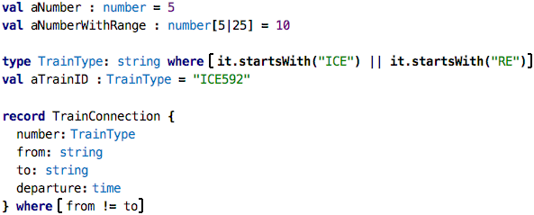
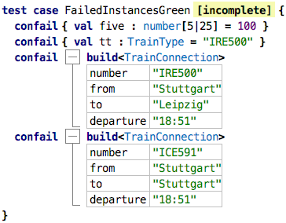
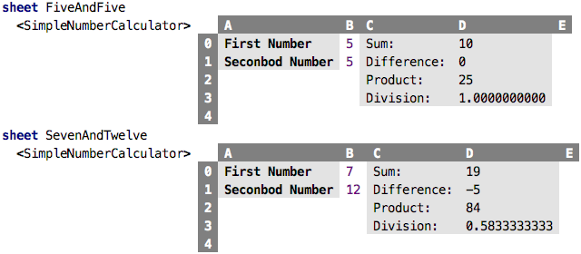
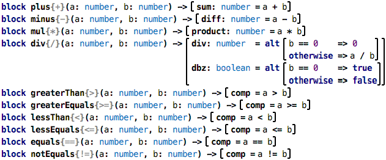
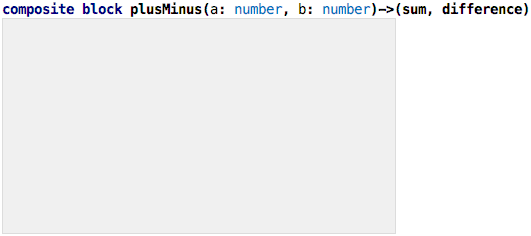
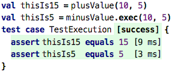

Go back to [Types](../chapter07_decAndCalc/index.md)

# Chapter 08: Instantiation

Like functions and function calls, instantiation is one of the most important
concepts in programming. And even though we have seen examples of instantiation before, I want to spend a whole chapter to drill the idea
into you.

### Instantiation recapped

So let us recap what we have seen of instantiation so far, as try to define
the idea as we go along. Consider the following program:

&nbsp;&nbsp;[src](http://127.0.0.1:63320/node?ref=r%3A3a1c0b08-ecea-441c-a1ee-79d5b39fbb64%28chapter08_instantiation%29%2F3051004821923634773)

The thing after the colon is the (explicitly given) type of the value `v`.
The literal `10` is the value. We could have written 

&nbsp;&nbsp;[src](http://127.0.0.1:63320/node?ref=r%3A3a1c0b08-ecea-441c-a1ee-79d5b39fbb64%28chapter08_instantiation%29%2F3051004821923637953)

as well. So both 10 and 20 have type `number`, otherwise we could not
legally write this code. The notion of instantiation is actually the 
inverse relationship of "has type". So instead of saying that 10 and 20
have type `number`, we could say that these two are both _instances_ 
of the type `number`. Values are instances of types.

Let us go back to records:

&nbsp;&nbsp;[src](http://127.0.0.1:63320/node?ref=r%3A3a1c0b08-ecea-441c-a1ee-79d5b39fbb64%28chapter08_instantiation%29%2F3051004821923638078)

This example captures the notion of a train connection (guess where I 
am writing this :-)). We can create values of this type, i.e., instances
by writing

&nbsp;&nbsp;[src](http://127.0.0.1:63320/node?ref=r%3A3a1c0b08-ecea-441c-a1ee-79d5b39fbb64%28chapter08_instantiation%29%2F3051004821923638553)

So what is different here compared to the `number` examples above? We 
provide values for each of the members of the record. So here, the type
can be seen as a kind of _template_ for constructing values. The template
defines "holes", i.e., things that an instance can define freely when they
are created. So different instances can be distinguished by the values they
have for the "holes". 

The type defines which values are valid for instances. Let's look at this
statement a little bit more closely by looking at the following examples:

&nbsp;&nbsp;[src](http://127.0.0.1:63320/node?ref=r%3A3a1c0b08-ecea-441c-a1ee-79d5b39fbb64%28chapter08_instantiation%29%2F3051004821923641974)

The first one defines a number without any further constraint (although
we know that if we don't specify a precision, no decimal digits are allowed,
so this is a kind of constraint). The `aNumberWithRange` is more picky, 
because the range specified on the type is of course a constraint on the
set of allowed values. The next example defines a new type based on the
`string` type. That new type, `TrainType`, has a constraint that expresses
that valid values have to begin with the string `ICE` or `RE` (two kinds
of trains in Germany, Intercity Express and Regional Express). Finally,
the new version of the `TrainConnection` defines a constraint that 
expresses that the train cannot arrive in the same city from which it
leaves. We get errors when we try to create instances that do not 
conform to these rules:

&nbsp;&nbsp;[src](http://127.0.0.1:63320/node?ref=r%3A3a1c0b08-ecea-441c-a1ee-79d5b39fbb64%28chapter08_instantiation%29%2F3051004821923643837)

As a side note, we can also write this test to _expect_ a constraint
failure, and thus not fail if, as in these examples, the constraint 
failure actually occurs. After all, we want tests to be green :-)

&nbsp;&nbsp;[src](http://127.0.0.1:63320/node?ref=r%3A3a1c0b08-ecea-441c-a1ee-79d5b39fbb64%28chapter08_instantiation%29%2F3051004821923648723)

Constraints expressed this way are checked at runtime, we have to 
actually run the tests. Checking them in the type system is too complicarted.
The only exception is the number ranges; here, the IDE actually reports
an error as soon as you write the program.				

Ok, so this is essentially a recap of what we have seen so far: instances
are values that have a particular type, that provide values for the "holes"
left open by the type, if any, and respect the constraints expressed by
the type, implicitly or explicitly. Let's look at more examples of this.

### Sheet Templates

Can we play with the idea of instantiation in Spreadsheets? What would
this mean? Look at the following example:

&nbsp;&nbsp;[src](http://127.0.0.1:63320/node?ref=r%3A3a1c0b08-ecea-441c-a1ee-79d5b39fbb64%28chapter08_instantiation%29%2F5888573917141666776)

This sheet computes the sum, difference, product and division of two numbers.
The particular numbers for which it does this are not specified. However,
this is a template sheet, i.e., a sheet that is intended for instantiation;
the two values that are used for the computations are the "holes" in the
type, i.e., they are specified in instances. For the expressions in the 
D column to type check, we have to give a type for the unspecified values
in column B. And in fact, the two cells there are constrained, as indicated
by the little `c` and the yellowish background color. If we show the sheet
in a slightly different way, we can see the constraints:

 

We define the type to be `number` for both, and for the second one
we even express that the value cannot be zero, because otherwise we'd run
into a division by zero when we divide the two numbers in cell D3.

So, let's create an instance:

&nbsp;&nbsp;[src](http://127.0.0.1:63320/node?ref=r%3A3a1c0b08-ecea-441c-a1ee-79d5b39fbb64%28chapter08_instantiation%29%2F5888573917142617703)

As you can see, it is automatically shown in "value mode", where all 
the expressions are already evaluated. No values have been provided for
the two numbers in column B so far. So it is actually an _invalid_ instance.
Let's provide values:

&nbsp;&nbsp;[src](http://127.0.0.1:63320/node?ref=r%3A3a1c0b08-ecea-441c-a1ee-79d5b39fbb64%28chapter08_instantiation%29%2F5888573917142623501)

Why did I show this example? I want to drive home the idea almost
anything can be made into a type, and thus be made instantiatable. Just
leave holes, let instances fill values for the holes, and check the 
hole-values provided by the instances against the constraints specified
by the type. That's it!
  
On a technical note: usually an instance retains a reference to its type.
In records, notice how an instance `#Person{"Markus", "Voelter"}` references
the record `Person`. Similarly, the spreadsheet instances shown above also
refer to the template spreadsheet in between the angle brackets. This is so
we can check the conformance of the instance against its type.

### Data Flow Blocks

If you are a "business person" you probably find the spreadsheet-based
examples intuitive because of your experience with Excel. If you are an
engineer, you probably want to see block diagrams. But even if you're not
an engineer, you will learn quite a bit from this example as well.

Take a look at the following code:
 
&nbsp;&nbsp;[src](http://127.0.0.1:63320/node?ref=r%3A3a1c0b08-ecea-441c-a1ee-79d5b39fbb64%28chapter07_decAndCalc%29%2F3051004821921841814)      
 
A block is a new abstraction, you can see it as a function that has 
more than one result. The `plusMinus` block takes two numbers, and 
returs two resultss: the `plus` result where `a` and `b` are added, 
as well as the `minus` result that subtracts the two. Two two results 
are computed separately, just as if it were a function with two bodies. 
So nothing really new here. In fact, if you think about it, it's really
almost exactly the same as the instantiatable spreadsheet example: we
also calculated several values (sum, difference, product, division) for
the same set of inputs.

You can also call a block as if it were a function. However, as we 
know, functions have only _one_ result. How can we package two results 
into one? We could use a list, or a record, or something
we have not seen before, a tuple:

&nbsp;&nbsp;[src](http://127.0.0.1:63320/node?ref=r%3A3a1c0b08-ecea-441c-a1ee-79d5b39fbb64%28chapter07_decAndCalc%29%2F3051004821923629272)

Tuple types are lists of types enclosed in square brackets, and the
values are written using the same notation, of course now as a list of
comma-separated expressions. When you have a tuple value in your hand,
you can use the `[]` notation to access the tuples' elements by position.

So, as a brief recap, here's a comparion between records, lists and tuples:

<table>
<tr>
<td></td><td> **Record** </td><td><b>List</b></td><td><b>Tuple</b></td>
</tr> 
<tr>
<td><b>Number of Elements</b></td><td> Fixed </td><td> Variable </td><td> Fixed </td>
</tr> 
<tr>
<td><b>Are elements named?</b></td><td> Named </td><td> Anonymous </td><td> Anonymous </td>
</tr> 
<tr>
<td><b>All elements same type?</b></td><td> Different Types </td><td> Same Type </td><td> Different Types </td>
</tr> 
<tr>
<td><b>Explicitly declared and named?</b></td><td> Declared </td><td> Anonymous </td><td> Anonymous </td>
</tr> 
</table>

So, returning to our blocks, the expression `plusMinus(5, 2)` in the test case
calls a block, and receives the two results as a tuple. We express the expected
result as a tuple as well.

Let us define a few more blocks:

&nbsp;&nbsp;[src](http://127.0.0.1:63320/node?ref=r%3A3a1c0b08-ecea-441c-a1ee-79d5b39fbb64%28chapter08_instantiation%29%2F3051004821923635556)

As you can see, these blocks essentially wrap the basic arithmetic and comparison
operators we have seen before. Most of them have exactly one output, except the 
`div` block, which also outputs if a division by zero would have occured because
the second argument was zero.

So what is the point of this exercise? These blocks can be used for graphical programming, where we draw diagrams that represent block instances and the flow of data
between them. We package such diagrams into yet other blocks, so-called _composite_ blocks, which can then be instantiated further. Let's illustrate this.

&nbsp;&nbsp;[src](http://127.0.0.1:63320/node?ref=r%3A3a1c0b08-ecea-441c-a1ee-79d5b39fbb64%28chapter08_instantiation%29%2F731163822144768116)

 

 

  

  

### Function Values

So, what about functions? Can we instantiate functions? Look at this code:

&nbsp;&nbsp;[src](http://127.0.0.1:63320/node?ref=r%3A3a1c0b08-ecea-441c-a1ee-79d5b39fbb64%28chapter08_instantiation%29%2F731163822146453013)

You could say that the function call "instantiates a function". After all, the 
function defines "holes", i.e., the parameters, and the call provides values.
The problem is that the function call executes right away, evaluates to the
result value (15 and 5 in the example above), and the assigns that value to the `val`.
Can function calls themselves be values? Let's see. 
 
&nbsp;&nbsp;[src](http://127.0.0.1:63320/node?ref=r%3A3a1c0b08-ecea-441c-a1ee-79d5b39fbb64%28chapter08_instantiation%29%2F731163822146454259)

In this code we create three values, and each of them stores a value `:add`.
The colon operator here creates a _reference to a function_. That reference
is a value, that value can be passed around and mofified, like any other value.
What is the type of that value? Let's ask the tool to automatically annotate
the types:

&nbsp;&nbsp;[src](http://127.0.0.1:63320/node?ref=r%3A3a1c0b08-ecea-441c-a1ee-79d5b39fbb64%28chapter08_instantiation%29%2F731163822148410629)

What we see here are _function types_, i.e., types that represent functions. The
type given here is the type of functions that take two `number`s as arguments
and produce another `number`. Both `plus` and `minus` conform to this type; they
take two numbers and produce another one.

What can we do with these values? One thing is that we can execute the functions,
by passing values:

&nbsp;&nbsp;[src](http://127.0.0.1:63320/node?ref=r%3A3a1c0b08-ecea-441c-a1ee-79d5b39fbb64%28chapter08_instantiation%29%2F731163822148618748)

Executing a function directly is exactly the same as executing a value that contains
a reference to that function. You can even use the same `()`-based syntax (as shwon
in the `thisIs15` example), alternatively you can also use an explicit call to 
`exec`. 

However, we can do other neat things. For example, as it is typical for instances,
we can provide values for parameters, _even without executing them_ at the same
time. This is similar to the configuration parameters in the data flow example
shown above. Consider the following:

&nbsp;&nbsp;[src](http://127.0.0.1:63320/node?ref=r%3A3a1c0b08-ecea-441c-a1ee-79d5b39fbb64%28chapter08_instantiation%29%2F731163822148617106)

Using `bind`, you specify some of the parameters of a function call (a process
called currying). So what happens here is that we use the `plusValue` (which 
is a reference to that original `plus` function that takes two numbers and 
produces a third one) and bind the first argument to 5. This results in a new
function value that now only takes _one_ argument (the first one was just bound
to 5) and adds 5 to that argument. We store this new function value
in the `val` named `thisAddsFive`. The type, as we see in
`thisAddsFiveWithType` is now a function that takes _one_ number and produces 
another one. As the tests show, we can now use this value as a function with one
argument.

So, if these things are values, we should be able not just to store them in `val`s,
but also to pass them around, right? Absolutely:

&nbsp;&nbsp;[src](http://127.0.0.1:63320/node?ref=r%3A3a1c0b08-ecea-441c-a1ee-79d5b39fbb64%28chapter08_instantiation%29%2F731163822148615391)

Check out the function `doWithList`. It takes two arguments. The first one
is a regular list of numbers. The second is a function that takes a number
and produces a number. The idea of `doWithList` is that is produces a new 
list, where the function we pass as the second argument is applied to all
elements of the list we pass as the first argument. We implement this 
function using the `map` operator on the list which we have seen before.

So do you realize what we have just done? We have implemented our own version
of `map`! We can rename the function and make it an extension function, the
we can literally use them in identical ways:

&nbsp;&nbsp;[src](http://127.0.0.1:63320/node?ref=r%3A3a1c0b08-ecea-441c-a1ee-79d5b39fbb64%28chapter08_instantiation%29%2F731163822148721273)

Well, not _quite_ identical. In the native case we explicitly execute the 
`thisAddsFive` function value with the `it` that represents the list's
element we currently iterate over. Can we simplify this?

&nbsp;&nbsp;[src](http://127.0.0.1:63320/node?ref=r%3A3a1c0b08-ecea-441c-a1ee-79d5b39fbb64%28chapter08_instantiation%29%2F731163822148834265)

Indeed we can. So what do these higher-order functions, natively built in
(like `map`, `where`, etc.) or built by us? They expect function types, i.e.,
functions that take and produce particularly-typed values. So going back to
our own higher-order function ...

&nbsp;&nbsp;[src](http://127.0.0.1:63320/node?ref=r%3A3a1c0b08-ecea-441c-a1ee-79d5b39fbb64%28chapter08_instantiation%29%2F731163822149617043)

... how can we construct valid values for the second argument? Here are
three ways:

&nbsp;&nbsp;[src](http://127.0.0.1:63320/node?ref=r%3A3a1c0b08-ecea-441c-a1ee-79d5b39fbb64%28chapter08_instantiation%29%2F731163822149730059)

We can pass a reference to a function whose signature is compatible (first test),
we can pass one whose signature has been made compatible through currying (second
test), and we can pass a value that represents an anonymous function. We have
not really seen those before, so let's close with explaining these.

So the `anonymousAdd5` value is what we call a lambda expression, or an anonymous
function. It defines one argument, `a: number` and then has a body that adds 5 to 
that `a`. The lambda itself has no name, but it doesn't need one, because we
assign it to a `val`. The following two are essentially equivalent:

&nbsp;&nbsp;[src](http://127.0.0.1:63320/node?ref=r%3A3a1c0b08-ecea-441c-a1ee-79d5b39fbb64%28chapter08_instantiation%29%2F731163822149753494)

The latter has the advantage that you can define it also in places other than
the top level of a program that contains functions, records or test cases. You
can, for example, define it inside a function ...

&nbsp;&nbsp;[src](http://127.0.0.1:63320/node?ref=r%3A3a1c0b08-ecea-441c-a1ee-79d5b39fbb64%28chapter08_instantiation%29%2F731163822149782496)

... or anonynously, in a call:

&nbsp;&nbsp;[src](http://127.0.0.1:63320/node?ref=r%3A3a1c0b08-ecea-441c-a1ee-79d5b39fbb64%28chapter08_instantiation%29%2F731163822149964105)

The `map` on collections is typically used with anonymous function values:

&nbsp;&nbsp;[src](http://127.0.0.1:63320/node?ref=r%3A3a1c0b08-ecea-441c-a1ee-79d5b39fbb64%28chapter08_instantiation%29%2F731163822149979862)

Because these one-argument anomymous lambdas are extremely common with collections
(because one wants to process each element, iteratively), there is a short form for
the lambdas that can _only_ be used with these higher-order collection operations.
The following code is identical to the previous one:

&nbsp;&nbsp;[src](http://127.0.0.1:63320/node?ref=r%3A3a1c0b08-ecea-441c-a1ee-79d5b39fbb64%28chapter08_instantiation%29%2F731163822150040686)

Here, the argument is automatically named `it`, and it is automatically typed
with the element type of the collection on which `map` or `where` is called.  
 
 

